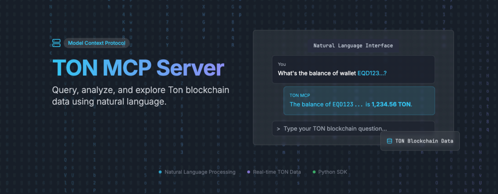

# TON BLOCKCHAIN MCP 

A Model Context Protocol (MCP) server for natural language interaction with the [TON blockchain](http://ton.org/).



## Features

- **Natural Language Processing**: Understand complex blockchain queries in plain English
- **Trading Analysis**: Analyze trading patterns, profitability, and strategies
- **Hot Trends Detection**: Find trending tokens, active pools, and high-activity accounts
- **Forensics & Compliance**: Conduct blockchain investigations and compliance checks
- **Real-time Data**: Access live TON blockchain data through TON API

## Quick Start

### Prerequisites

- Python 3.10+
- TON API key from [TONAPI](https://tonconsole.com/tonapi)

### Installation

1. Clone the repository:
```bash
git clone https://github.com/devonmojito/ton-blockchain-mcp.git
cd ton-blockchain-mcp
```

2. Install dependencies:
```bash
pip install -r requirements.txt
```

3. Set up environment variables:
* You might want to put the API key in .env as well
```bash
export TON_API_KEY=your_api_key_here
```

4. Run the server:
```bash
python -m src.mcp_server
```

### PyPI Installation

You can also install the TON MCP Server directly from PyPI:

```bash
pip install ton-mcp-server
```

### Using Docker

```bash
# Build and run with Docker Compose
docker-compose up --build
```

---

## Example: Using TON MCP Server with Claude Desktop

You can easily use this MCP server with Claude Desktop for natural language blockchain queries. Below is an example of checking the TON balance for a wallet address:


### Claude Desktop Configuration Example

To use this MCP server with Claude Desktop, add the following to your Claude Desktop config:
* You might need to replace the Python env setup with your own.

```json
{
  "mcpServers": {
    "ton-mcp-server": {
      "command": "/Users/devon/ton-mcp/ton-mcp-server/venv/bin/python",
      "args": [
        "-m",
        "tonmcp.mcp_server"
      ],
      "cwd": "/Users/devon/ton-mcp/ton-mcp-server/src",
      "env": {
        "PYTHONPATH": "/Users/devon/ton-mcp/ton-mcp-server/src"
      }
    }
  }
}
```

---

## Usage

### Basic Queries

```python
import asyncio
from mcp_client import McpClient

async def main():
    client = McpClient("http://localhost:8000")
    
    # Analyze an address
    result = await client.call_tool("analyze_address", {
        "address": "EQD1234...",
        "deep_analysis": True
    })
    print(result)

asyncio.run(main())
```

### Natural Language Examples

- "What's the balance of address EQD1234...?"
- "Find hot trading pairs in the last hour"
- "Analyze trading patterns for this wallet"
- "Show suspicious activity for address ABC"
- "Trace money flow from this address"

## Configuration

Configuration can be provided via:
- Environment variables
- `config/settings.json` file
- Runtime parameters

Key configuration options:
- `TON_API_KEY`: Your TON API key
- `MCP_HOST`: Server host (default: localhost)
- `MCP_PORT`: Server port (default: 8000)
- `LOG_LEVEL`: Logging level (default: INFO)

## MCP Tools & System Prompts Documentation

### Tools

#### analyze_address
Analyze a TON address for its balance, jetton holdings, NFTs, and recent activity. Optionally performs deep forensic analysis if `deep_analysis` is True. Use for questions about account overview, holdings, or activity.

**Parameters:**
- `address` (str): TON address to analyze
- `deep_analysis` (bool, optional): Enable deep forensic analysis

#### get_transaction_details
Get details and analysis for a specific TON blockchain transaction by its hash. Use for questions about a particular transaction, its participants, value, or type.

**Parameters:**
- `tx_hash` (str): Transaction hash

#### find_hot_trends
Find trending tokens, pools, or accounts on the TON blockchain for a given timeframe and category. Use for questions about what's hot, trending, or popular on TON.

**Parameters:**
- `timeframe` (str, optional): Time period (e.g., 1h, 24h, 7d)
- `category` (str, optional): Type of trends (tokens, pools, accounts)

#### analyze_trading_patterns
Analyze trading patterns for a TON address over a specified timeframe. Use for questions about trading activity, frequency, jetton transfers, or DEX swaps for an account.

**Parameters:**
- `address` (str): TON address
- `timeframe` (str, optional): Time period (e.g., 24h)

#### get_ton_price
Get the current real-time TON price in the specified currency (default: USD) and recent price changes. Use this tool whenever you need the latest TON price for calculations, analysis, or reporting.

**Parameters:**
- `currency` (str, optional): The fiat or crypto currency to get the TON price in (default: 'usd').

#### get_jetton_price
Get the current price and recent changes for specified jetton tokens (not TON) in the given currency. Provide a list of jetton master addresses as tokens. Use this tool to fetch real-time prices for any token except TON.

**Parameters:**
- `tokens` (list of str): List of jetton master addresses to get prices for (excluding 'ton').
- `currency` (str, optional): The fiat or crypto currency to get the price in (default: 'usd').

### System Prompts

- `trading_analysis`: Generate trading analysis prompts
- `forensics_investigation`: Generate forensics prompts
- `trend_analysis`: Generate trend analysis prompts

## Contributing

1. Fork the repository
2. Create a feature branch
3. Commit your changes
4. Push to the branch
5. Create a Pull Request

## License

This project is licensed under the MIT License - see the [LICENSE](LICENSE) file for details.

## Support

For support, please open an issue on GitHub 

**⚠️ WARNING: This project is in Beta. Do not trust any numbers provided by the LLM model. Nothing in this project constitutes financial advice. Use at your own risk.**